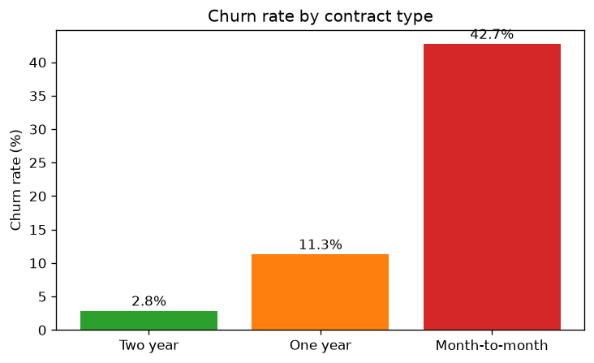
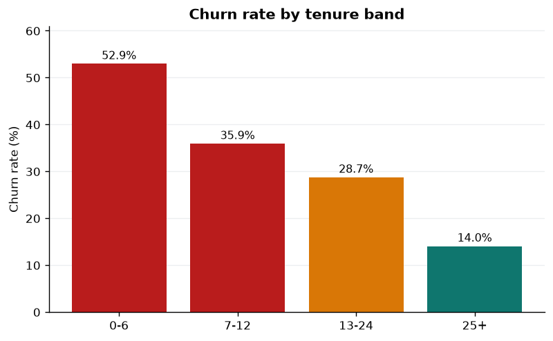
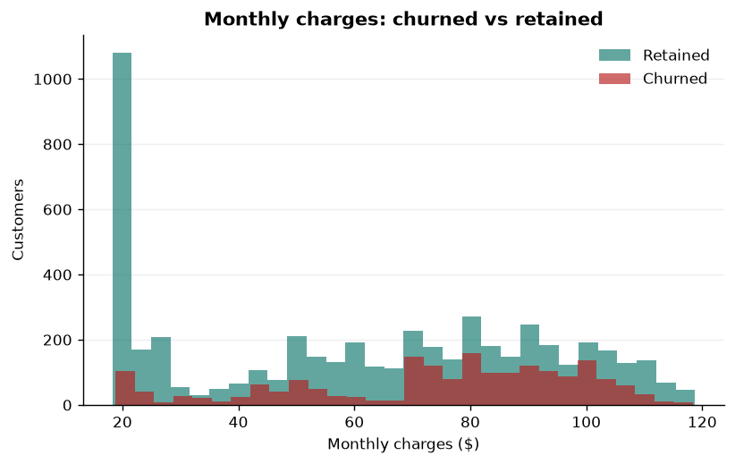
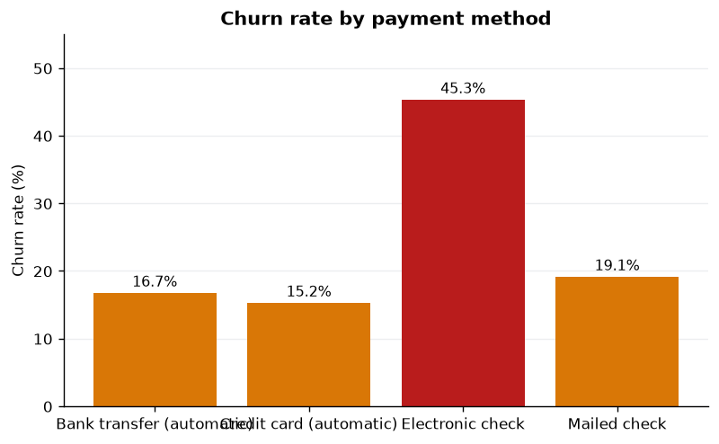
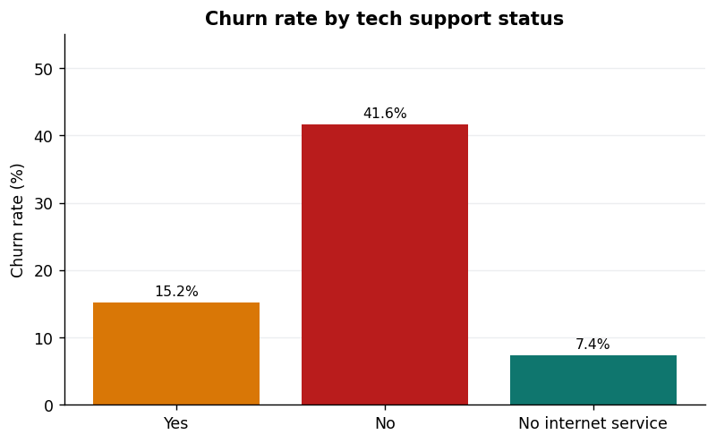
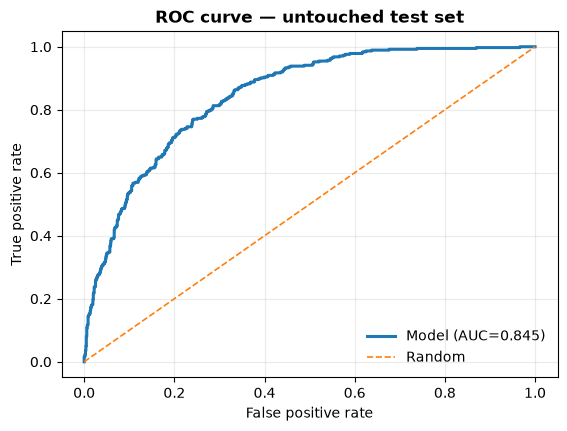
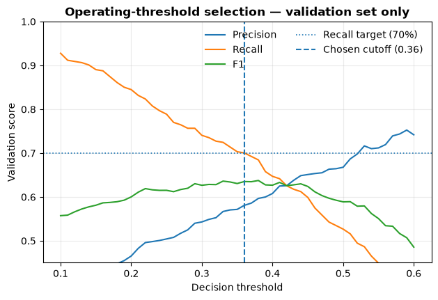
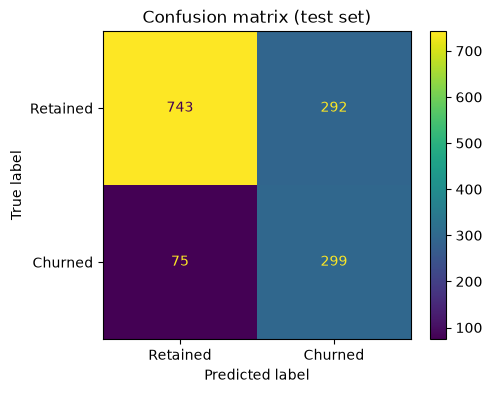

# Customer Churn Analytics with AI — Final Project Report

**Author:** Akshay  
**Date:** 2026-09-24  
**Program:** IBM SkillsBuild Academic Internship (BharatCares / AICTE) — Data Analytics with AI

## 1. Objective

The objective is to identify telecom customers at elevated churn risk, understand the strongest observable churn patterns, and translate those findings into practical retention hypotheses and prioritization rules. The project covers data quality, exploratory analysis, predictive modeling, explainability, an interactive Streamlit dashboard, and deployment-ready packaging.

## 2. Dataset and data quality

The project uses the IBM Telco Customer Churn dataset with **7,043 customers and 21 raw columns**. The variables cover customer demographics, tenure, contract and billing information, phone/internet services, and the target `Churn`.

The main raw-data issue is `TotalCharges`, which contains 11 blank values. All 11 occur for customers with zero tenure, so these values are converted to numeric and filled with 0.0. No rows are dropped. Customer IDs are unique, and no missing values remain in the model input columns after cleaning.

Engineered analysis features include:

- `tenure_band`: 0-6, 7-12, 13-24, 25+ months
- `num_services`: count of service fields equal to `Yes`
- `is_fiber`, `is_month_to_month`, `is_electronic_check`: analysis-only indicators
- `churn_binary`: 1 for churned, 0 for retained

Exact duplicate indicators are intentionally excluded from the final model when the original categorical variable already carries the same information.

## 3. Observations

- **O1. Contract:** month-to-month customers churn at **42.7%**, compared with **11.3%** for one-year contracts and **2.8%** for two-year contracts.
- **O2. Tenure:** customers in months 0-6 churn at **52.9%**, while the 25+ month group churns at **14.0%**.
- **O3. Monthly charges:** churned customers average **$74.44/month** versus **$61.27/month** for retained customers.
- **O4. Customer age with company:** median tenure is **29 months**, and **31.0%** of customers are within their first year.
- **O5. Internet service:** fiber-optic customers churn at **41.9%**, compared with **19.0%** for DSL and **7.4%** for customers with no internet service.
- **O6. Payment method:** electronic-check customers churn at **45.3%**, while bank-transfer and credit-card automatic payment groups are much lower.
- **O7. Tech support:** customers without tech support churn at **41.6%** compared with **15.2%** among customers with tech support.
- **O8. Senior-citizen segment:** senior citizens churn at **41.7%** compared with **23.6%** for non-seniors.

These are descriptive associations. They do not prove that changing one feature by itself would cause churn to rise or fall.

## 4. Insights

- **I1. Low commitment and short tenure identify a high-risk customer profile.** The largest observed churn rates occur in month-to-month and early-tenure groups.
- **I2. Fiber customers deserve focused investigation.** Their churn rate is high enough to justify separate pricing, support, and experience analysis.
- **I3. Support and billing variables are useful targeting signals.** No-tech-support and electronic-check groups show substantially higher churn, but these relationships may reflect other underlying customer differences.
- **I4. A predictive score can prioritize outreach more effectively than using one segment rule alone.** The model reaches a test ROC-AUC of **0.8451**, showing useful ranking ability.

## 5. Hypotheses

These are hypotheses for controlled testing, not conclusions from the observational dataset:

- **H1. Contract offer:** a targeted one-year contract incentive for high-risk month-to-month customers will improve retention relative to business-as-usual outreach.
- **H2. Early support:** structured 30/60/90-day support contacts for new customers will reduce first-year churn.
- **H3. Fiber experience:** proactive support or a value-focused fiber offer will reduce churn in high-risk fiber cohorts.
- **H4. Payment migration:** encouraging suitable electronic-check customers to use automatic payment will improve retention if the payment method is partly capturing friction rather than only customer mix.

## 6. Recommendations

- **R1. Prioritize rather than blanket-contact.** Use the model's operating cutoff to create a manageable retention queue.
- **R2. Focus onboarding resources on early tenure.** New customers should receive proactive support before dissatisfaction becomes churn.
- **R3. Investigate fiber churn separately.** Combine churn analytics with support-ticket, outage, speed, and pricing data before choosing an intervention.
- **R4. Measure retention interventions experimentally.** Track treatment/control groups or another defensible causal design before claiming that an offer causes lower churn.

## 7. Model design

The final model is an interpretable scikit-learn pipeline:

1. `OneHotEncoder(handle_unknown='ignore', drop='first')` for categorical features.
2. `StandardScaler` for numeric features.
3. `LogisticRegression(max_iter=2000, random_state=42)`.

The model uses 20 raw input features: 16 categorical and 4 numeric. Exact duplicate analysis indicators are not included. `TotalCharges` remains part of EDA and data quality but is excluded from the live model because a prediction form cannot reconstruct historical billed total reliably from current monthly charges and tenure.

### Data splitting and threshold selection

A stratified **60/20/20 train/validation/test split** is used:

- train: 4,225 rows
- validation: 1,409 rows
- untouched test: 1,409 rows

The operating cutoff is selected **only on validation data**. The rule is to maximize precision while keeping validation recall at or above 70%. This produces a cutoff of **0.36**. After that value is frozen, the same pipeline specification is refit on train + validation data and evaluated once on the untouched test set.

This avoids the earlier methodological problem of choosing an operating threshold directly from test-set results.

## 8. Model results

### Overall ranking performance

- ROC-AUC: **0.8451**
- Average precision: **0.6487**
- Brier score: **0.1366**
- Majority-class accuracy baseline: **0.7346**

### Standard 0.50 cutoff

| Metric | Value |
|---|---:|
| Accuracy | 0.8013 |
| Precision | 0.6610 |
| Recall | 0.5160 |
| F1 | 0.5796 |
| True positives | 193 |
| False positives | 99 |
| False negatives | 181 |
| True negatives | 936 |

### Validation-selected operating cutoff 0.36

| Metric | Value |
|---|---:|
| Accuracy | 0.7771 |
| Precision | 0.5649 |
| Recall | 0.6979 |
| F1 | 0.6244 |
| True positives | 261 |
| False positives | 201 |
| False negatives | 113 |
| True negatives | 834 |

The lower operating cutoff is appropriate for a low-cost retention-contact workflow because it identifies substantially more churners, at the expense of contacting more customers who would have stayed anyway.

## 9. Explainability

The model is linear and interpretable. Categorical coefficients are relative to their dropped reference category, while numeric-feature odds ratios are interpreted per one standard-deviation increase. The dashboard also computes exact per-customer contributions to the model's log-odds.

These explanations describe how the fitted model arrives at a score. They should not be interpreted as proof that an individual feature causes churn.

## 10. Dashboard and deployment

The Streamlit dashboard contains four functional pages:

1. **Overview** — KPIs, churn composition, and high-churn segments.
2. **Explore** — interactive cohort filtering, charts, and data export.
3. **Predictor** — live churn scoring with impossible service combinations prevented, explanation bars, what-if analysis, and an illustrative ROI calculator.
4. **Model & Report** — untouched-test metrics, threshold-selection evidence, ROC/confusion visuals, coefficient effects, methodology, and limitations.

The serialized model is loaded in-process by Streamlit; there is no separate REST API to wire or deploy. Repository-relative paths are used throughout. A Dockerfile, Streamlit configuration, CI workflow, and `src/04_validate.py` are included for deployment and submission checks.

## 11. Limitations

- The data is static and has no timestamped observation window, so temporal generalization is not measured.
- Real telco churn behavior may differ from this public sample.
- Risk can drift as product, price, and service policies change.
- The model does not establish causal treatment effects.
- Fairness and subgroup performance require a dedicated review before real-world use.
- ROI outputs are scenario calculations based on user assumptions, not measured campaign outcomes.

## 12. Conclusion

The project demonstrates a complete and defensible analytics workflow: raw-data checks, reproducible cleaning, focused EDA, leakage-safe model selection, untouched-test evaluation, interpretable scoring, and deployment-ready presentation. The strongest descriptive pattern is concentrated churn among short-tenure and month-to-month customers, while the model provides a more complete ranking signal for retention prioritization.
