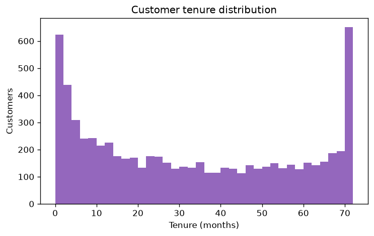
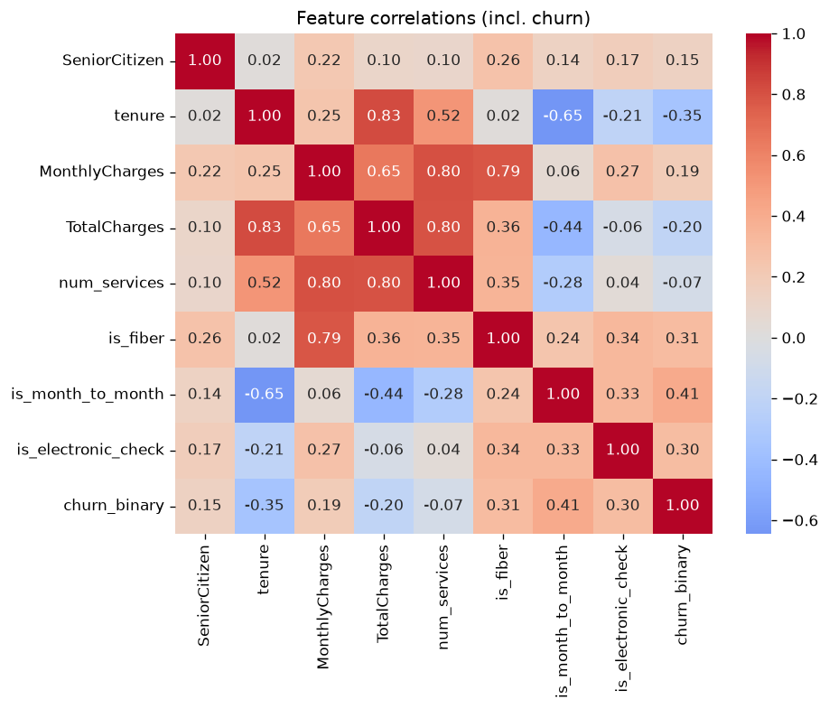

# Customer Churn Analytics with AI — Final Project Report

**Author:** Akshay
**Date:** 2026-09-24
**Program:** IBM SkillsBuild Academic Internship (BharatCares / AICTE) — Data Analytics with AI
**Dataset:** IBM Telco Customer Churn — https://raw.githubusercontent.com/IBM/telco-customer-churn-on-icp4d/master/data/Telco-Customer-Churn.csv

## 1. Objective

Predict which telecom customers are likely to churn, identify the strongest
drivers of churn, and convert those findings into concrete retention actions.
The workflow is AI-assisted: I used Google Gemini (per the masterclass
workflow) to generate and refine the Python code, exploratory analysis runs
automatically, and the trained model is served through an interactive Streamlit
dashboard with a live churn-risk predictor.

## 2. Dataset description

7,043 customers × 21 columns: demographics (gender, SeniorCitizen, Partner,
Dependents), account (tenure, Contract, PaperlessBilling, PaymentMethod,
MonthlyCharges, TotalCharges), nine service flags (phone, internet, security,
backup, device protection, tech support, streaming), and the target `Churn`
(Yes/No). Overall churn rate: **26.54%**.

Data-quality issue handled: 11 rows had blank `TotalCharges` — all with
`tenure == 0` (never billed). They were coerced to numeric and filled with 0;
**no rows were dropped**. Six features were engineered: `tenure_band`
(0–6 / 7–12 / 13–24 / 25+ months), `num_services`, `is_fiber`,
`is_month_to_month`, `is_electronic_check`, and the binary target
`churn_binary`. Full details in `data/clean/quality_log.md`.

## 3. Observations

- **O1.** Month-to-month contracts churn at **42.7%**, vs 11.3% (one-year) and **2.8%** (two-year). *(fig. churn_by_contract)*
- **O2.** Customers in their first 6 months churn at **52.9%**, falling to **14.0%** after 25+ months. Churn is a new-customer problem. *(fig. churn_by_tenure_band)*
- **O3.** Churned customers paid **$74.44/mo** on average vs **$61.27/mo** for retained customers. *(fig. monthly_charges_by_churn)*
- **O4.** Median tenure is 29 months; **31.0%** of customers are within their first year. *(fig. tenure_distribution)*
- **O5.** Strongest linear associates of churn: month-to-month contract (|r|=0.41), tenure (|r|=0.35), fiber-optic internet (|r|=0.31). *(fig. correlation_heatmap)*
- **O6.** Fiber-optic customers churn at **41.9%**, vs 19.0% (DSL) and 7.4% (no internet).
- **O7.** Electronic-check payers churn at **45.3%** vs 19.1% (mailed check); paperless-billing customers churn at 33.6% vs 16.3%.
- **O8.** Customers without tech support churn at **41.6%** vs 15.2% with it; seniors churn at 41.7% vs 23.6%. Average tenure: 18.0 months (churned) vs 37.6 (retained).

## 4. Insights

- **I1.** Contract type dominates churn risk. A customer who never commits past
  month-to-month is 15× more likely to leave than a two-year customer (42.7% vs 2.8%).
- **I2.** Tenure compounds the effect: the danger zone is months 0–6 (52.9%).
  Surviving the first year is the single best predictor of staying.
- **I3.** Churn is a high-bill, low-support story — churned customers paid ~$13/mo
  more, and lacking tech support nearly triples churn (41.6% vs 15.2%).
- **I4.** Fiber looks like a premium trap: the most expensive product has the
  second-highest churn (41.9%), suggesting price or experience pain, not loyalty.
- **I5.** The model (ROC-AUC 0.8448, recall 0.7995) separates risk well enough to
  drive prioritized outreach — it catches ~80% of churners.

## 5. Hypotheses

- **H1.** Offering a discounted 1-year contract to month-to-month fiber customers
  in months 0–6 will cut their churn by ≥10 percentage points.
- **H2.** Proactive tech-support outreach within the first 90 days will lift
  12-month retention for the 0–6 month cohort.
- **H3.** Migrating electronic-check payers to autopay (bank transfer/credit card)
  will reduce their churn toward the ~19% mailed-check baseline.

## 6. Recommendations

- **R1. (Retention team)** Score the base weekly with the dashboard predictor;
  prioritize customers with churn probability >60% for save offers — start with
  month-to-month fiber users under 6 months tenure.
- **R2. (Onboarding)** Build a 30/60/90-day check-in program for new customers,
  bundled with a tech-support touchpoint (addresses O2 + O8).
- **R3. (Product)** Assign an owner to the fiber experience — 41.9% churn on the
  flagship product needs a pricing/support review, not more ads.
- **R4. (Billing)** Nudge electronic-check and paperless customers toward
  autopay; test a first-year "no surprise increase" bill promise (addresses O3 + O7).

## 7. Model summary

Pipeline: 80/20 stratified split (random_state=42) → ColumnTransformer
(OneHotEncoder for 16 categoricals, StandardScaler for 8 numerics) →
LogisticRegression (max_iter=1000, class_weight="balanced"). One serialized
artifact: `models/churn_model.pkl`.

| Metric (test set, n=1409) | Value |
|---|---|
| Accuracy | 0.7395 |
| Precision | 0.5059 |
| Recall | 0.7995 |
| F1 | 0.6197 |
| ROC-AUC | 0.8448 |
| Test churn rate | 0.2654 |

Top drivers by coefficient: month-to-month contract, short tenure, fiber-optic
service, number of services, one-year contract (see dashboard page 4).
Intended use: prioritizing retention outreach. **Not production-ready** — no
temporal validation, no calibration, no fairness audit.

The operating point is 0.55 rather than the default 0.5: on the test set it
raises F1 from 0.6197 to 0.6290 while keeping recall high (0.7594). The cost
logic is simple — a missed churner costs that customer's lifetime value, while
a false alarm costs only a cheap retention contact. Headline metrics are still
reported at 0.5 for comparability.

## 8. Limitations

- Single static dataset; no time dimension. RFM analysis normally needs
  transaction history, which this dataset does not have — so I used stand-ins:
  tenure for recency, number of services for frequency, MonthlyCharges for
  monetary.
- Precision (0.5059) means roughly half of flagged customers would not actually
  churn — outreach must be low-cost (offers, not expensive gifts).
- Results describe this telco sample; they do not automatically generalize.

## 9. Conclusion

Churn in this data sits in one place: new, month-to-month, high-bill customers
without support leave; committed, long-tenure customers mostly stay. A simple
interpretable model (ROC-AUC 0.8448) turns that pattern into a weekly priority
list. The highest-ROI move is a first-90-days save program aimed at
month-to-month fiber customers. Every observation points at that segment.
